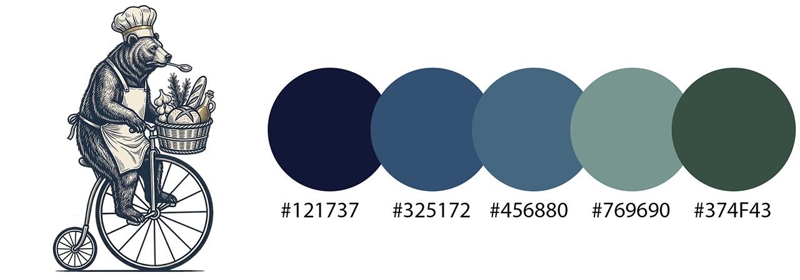

# ÚRSULA-2026

<p align="center">
  
</p>

## Información Institucional
* **Universidad:** Universidad Tecnológica Nacional - Facultad Regional Avellaneda
* **Carrera:** Tecnicatura Universitaria en Programación
* **Materia:** Trabajo Final Integrador
* **Nombre del Grupo:** ursula-2026
* **Integrantes:** 
    * Maldonado, Julian
    * Rial, Carlos
    * Moreyra, Nicolás Rodrigo
* **Docentes:** 
    * Neiner, Maximiliano
    * Constanzo, Alejandro
    * Villegas, Octavio
    * Ferrero, Nicolás
    * Morelli, Augusto  
    * Loredo, Alejandro

---

# Sistema de Gestión para Restaurante

## Descripción

Aplicación desarrollada como Trabajo Final Integrador para la Tecnicatura Universitaria en Programación (UTN).

El sistema permite gestionar el flujo completo de clientes dentro de un restaurante, así como la interacción entre los distintos perfiles del sistema (dueño, supervisor, metre, mozo, cocinero, cantinero y cliente), desde el ingreso al local hasta su ubicación en una mesa y acceso al menú digital, dejando preparado el entorno para la gestión de pedidos.

---


## Códigos QR

| Ingreso al Local | Mesa (Cliente) | Propinas | 
| :---: | :---: | :---: | 
|  |  | |
| **Acción:** Registro en espera | **Acción:** Menú y Pedidos | **Acción:** Feedback | 

---

## Guía de Instalación y Ejecución (Windows)

## 1. Requisitos Previos
1.  **Git:** [Descargar e instalar](https://git-scm.com/)
2.  **Node.js (LTS):** [Descargar e instalar](https://nodejs.org/) (incluye npm)
3.  **Ionic CLI:** Instalación global mediante terminal:
    ```bash
    npm install -g @ionic/cli
    ```
## 2. Configuración del Entorno
### Frontend (Node/Ionic):
#### Instalar módulos de Node
```bash
npm install
```
---

### 3. Clonar el Repositorio
Abre tu terminal (PowerShell o CMD) y ejecuta:

```bash
git clone https://github.com/JulianJm04/ursula-2026.git
cd ursula-2026
```
---
### 4. Ejecución de la Aplicación
Para levantar el servidor de desarrollo y la interfaz:

#### Opción recomendada
```bash
ionic serve
```
---

## Tecnologías utilizadas

<div style="display: flex; flex-wrap: wrap; gap: 8px;">
  
  
  
  
  
  
  
</div>

---

## Seguimiento de Puntos Funcionales

| ID | Requerimiento (Consigna) | Componentes / Lógica Técnica | Responsable | Rama/ Base de datos | Fecha Inicio | Fecha Fin | Estado |
| :--- | :--- | :--- | :--- | :--- | :---: | :---: | :---: |
| **0** | **Req. Iniciales y Arquitectura** | **Pantallas:** Splash Animada y Estática (Logo, Grupo, Nombres). | Julian | `main` | 30/03/2026 | 13/04/2026 | Completado |
| | | **Organizacion:** Desarrollo de la metodologia de Sprints 01. | Nicolas | `---` | 08/04/2026 | 12/04/2026 | Completado |
| | | **Organizacion:** Desarrollo de la metodologia de Sprints 02. | Nicolas | `---` | 19/04/2026 | 21/04/2026 | Completado |
| | | **Lógica:** App en español, sin botones fijos/combos, Sonidos on/off, Spinners corporativos, Vibración en errores. | Julian/Carlos | `main` | 11/04/2026 | --- | Pendiente |
| | | **Diseño:** Contraste nítido, sin fondos blancos/negros puros, prohibido modo oscuro, UI sin espacios neutros. | Julian | `main` | 30/03/2026 | --- | En proceso |
| | | **DB/Setup:** Datos simulados pre-cargados (Usuarios de todos los perfiles, 5 Platos, 5 Bebidas, 5 Mesas). | Carlos | `supabase` | 11/04/2026 | 15/04/2026 | Completado |
| **1** | **Alta Empleado**<br>*(Dueño/Supervisor)* | **Pantallas:** Formulario ABM Empleados (Cámara Nativa, Lector QR). | Carlos | `test` | 15/04/2026 | 18/04/2026 | Completado |
| | | **Lógica:** Lector QR DNI, Captura foto, Validación estricta de todos los campos. | Carlos | `test` | 15/04/2026 | 19/04/2026 | Completado |
| | | **DB:** Insert tabla `usuarios` (Perfil empleado, hashes clave). | Carlos | `supabase` | 18/04/2026 | 20/04/2026 | Completado |
| **2** | **Alta Plato**<br>*(Cocinero)* | **Pantallas:** Formulario ABM Platos (UI con 3 contenedores centrados). | Carlos | `test` | 16/04/2026 | 21/04/2026 | Completado |
| | | **Lógica:** Captura/Selección 3 fotos, Validar campos, Verificar existencia en menú. | Carlos | `test` | 17/04/2026 | 22/04/2026 | Completado |
| | | **DB:** Insert tabla `productos` (tipo: plato). | Julian | `supabase` | 17/04/2026 | 17/04/2026 | Completado |
| **3** | **Alta Bebida**<br>*(Cantinero)* | **Pantallas:** Formulario ABM Bebidas (UI con 3 contenedores centrados). | Por definir | `---` | --- | --- | --- |
| | | **Lógica:** Captura/Selección 3 fotos, Validar campos, Verificar existencia. | Por definir | `---` | --- | --- | --- |
| | | **DB:** Insert tabla `productos` (tipo: bebida). | Julian | `supabase` | 17/04/2026 | 17/04/2026 | Completado |
| **4** | **Alta Mesa**<br>*(Dueño/Supervisor)* | **Pantallas:** Formulario ABM Mesas (Capacidad, Tipo, Foto centrada). | Por definir | `---` | --- | --- | --- |
| | | **Lógica:** Generación visual de código QR único por mesa. | Carlos | `test` | 21/04/2026 | 26/04/2026 | Completado |
| | | **DB:** Insert tabla `mesas` (verificar número único). | Julian | `supabase` | 18/04/2026 | 18/04/2026 | Completado |
| **5** | **Crear Cliente**<br>*(Registrado)* | **Pantallas:** Sign-up Cliente (Cámara, Lector QR DNI). | Carlos | `test` | 20/04/2026 | 26/04/2026 | Completado |
| | | **Lógica:** Validaciones, auto-completado DNI, Email autom. "Pendiente". | Nicolas | `test3` | 22/04/2026 | 28/04/2026 | Completado |
| | | **DB:** Insert tabla `usuarios` (estado: pendiente). | Julian | `supabase` | 17/04/2026 | 17/04/2026 | Completado |
| **6** | **Verificar Ingreso**<br>*(Dueño/Supervisor)* | **Pantallas:** Dashboard Clientes Pendientes (Foto grande + Nombres). | Por definir | `---` | --- | --- | --- |
| | | **Lógica:** Recepción de Push Notification al registrarse un nuevo cliente, Botones Aceptar/Rechazar. | Por definir | `---` | --- | --- | --- |
| | | **DB:** Select tabla `usuarios` filtrado por estado pendiente. | Por definir | `---` | --- | --- | --- |
| **7** | **Rechazar Cliente**<br>*(Dueño/Supervisor)* | **Pantallas:** Background (No UI directa para el cliente). | N/A | N/A | N/A | N/A | --- |
| | | **Lógica:** Bloqueo de login (Mensaje alusivo), Envío Automático Email empresarial (Diseño custom, logo, fuentes). | Nicolas | `supabase` | --- | ---| Completado |
| | | **DB:** Update tabla `usuarios` (estado: rechazado). | Por definir | `---` | --- | --- | --- |
| **8** | **Aceptar Cliente**<br>*(Dueño/Supervisor)* | **Pantallas:** Background (No UI directa). | N/A | N/A | N/A | N/A | --- |
| | | **Lógica:** Habilitar login, Envío Automático Email Bienvenida empresarial (Diseño distinto al rechazo). | Nicolas | `supabase` | --- | --- | Completado |
| | | **DB:** Update tabla `usuarios` (estado: activo). | Por definir | `---` | --- | --- | --- |
| **9** | **Cliente Anónimo**<br>*(Lista de Espera)* | **Pantallas:** Formulario Ingreso Rápido (Nombre, Foto), Lector QR Local. | Carlos | `---` | --- | --- | --- |
| | | **Lógica:** Bloqueo de asignación directa, Push Notif al Metre. Acceso restringido solo a encuestas previas. | Por definir | `---` | --- | ---| --- |
| | | **DB:** Insert tabla `lista_espera`. | Julian | `supabase` | 20/04/2026 | 20/04/2026 | Completo |
| **10** | **Asigna Mesa**<br>*(Metre)* | **Pantallas:** Dashboard Metre, Lector QR (Cliente). | Julian | `test` | 20/04/2026 | 20/04/2026 | Completado |
| | | **Lógica:** Asignación Metre -> Push Cliente. Cliente Escanea Mesa -> Valida vínculo único y bloqueo doble ocupación. | Por definir | `---` | --- | --- | --- |
| | | **DB:** Update `mesas` (ocupada) y tabla relacional/pedidos. | Por definir | `---` | --- | --- | --- |
| **11** | **Menú y Consulta**<br>*(Cliente / Mozo)* | **Pantallas:** Menú (3 fotos por producto), Sala Chat UI (Estilo WhatsApp). | Julian/ Nicolas | `main` | 17/04/2026 | --- | En proceso |
| | | **Lógica:** Botón Consulta -> Push Notif a todos los mozos. Chat realtime (Hora/Fecha/Mesa). | Nicolas | `---` | --- | --- | --- |
| | | **DB:** Select `productos`, Insert/Realtime tabla `mensajes`. | Por definir | `---` | --- | --- | --- |
| **12** | **Realizar Pedido**<br>*(Cliente)* | **Pantallas:** Carrito de Compras. | Por definir | `---` | --- | --- | --- |
| | | **Lógica:** Importe total visible siempre, Tiempo estimado acumulado, Push Mozo (Espera Confirmación). | Por definir | `---` | --- | --- | --- |
| | | **DB:** Insert tabla `pedidos` y tabla `detalle_pedido`. | Por definir | `---` | --- | --- | --- |
| **13** | **Rechazo Pedido**<br>*(Mozo / Cliente)* | **Pantallas:** Carrito Editable (Cliente). | Por definir | `---` | --- | --- | --- |
| | | **Lógica:** Mozo rechaza -> Push Cliente. Cliente edita/agrega/quita -> Push Mozo. | Por definir | `---` | --- | --- | --- |
| | | **DB:** Update tabla `pedidos`. | Por definir | `---` | --- | --- | --- |
| **14** | **Confirmar Pedido**<br>*(Mozo)* | **Pantallas:** Background Handler. | N/A | N/A | N/A | N/A | ⚪ |
| | | **Lógica:** División de comandas -> Push Sector Cocina y/o Bar. Habilita Hub de Juegos al cliente. | Por definir | `---` | --- | --- | --- |
| | | **DB:** Update tabla `pedidos` (estado: en preparacion). | Por definir | `---` | --- | --- | --- |
| **15** | **Sistema Juegos**<br>*(Cliente Reg)* | **Pantallas:** Hub 3 Juegos Funcionales. | Por definir | `---` | --- | --- | --- |
| | | **Lógica:** Control "1er Intento". Asignación descuento (10%, 15%, 20%). Desbloqueo libre post-intento. | Por definir | `---` | --- | --- | --- |
| | | **DB:** Insert/Update tabla `descuentos`/`pedidos`. | Por definir | `---` | --- | --- | --- |
| **16** | **Sector Cocina**<br>*(Cocinero)* | **Pantallas:** Dashboard Comandas Cocina (UI Espaciada, Agrupada x Mesa). | Por definir | `---` | --- | --- | --- |
| | | **Lógica:** Filtrado de ítems tipo comida, Cambio de estado (Listo). Cliente verifica estado con QR Mesa. | Por definir | `---` | --- | --- | --- |
| | | **DB:** Update `detalle_pedido` (estado sector). | Por definir | `---` | --- | --- | --- |
| **17** | **Sector Bar**<br>*(Cantinero)* | **Pantallas:** Dashboard Bebidas (UI Espaciada, Agrupada x Mesa). | Por definir | `---` | --- | --- | --- |
| | | **Lógica:** Filtrado ítems tipo bebida, Cambio de estado (Listo). Cliente verifica con QR Mesa. | Por definir | `---` | --- | --- | --- |
| | | **DB:** Update `detalle_pedido` (estado sector). | Por definir | `---` | --- | --- | --- |
| **18** | **Aviso "Listo"**<br>*(Sectores -> Mozo)* | **Pantallas:** Dashboard Entregas (Mozo). | Por definir | `---` | --- | --- | --- |
| | | **Lógica:** Combinador de estados: Push Notif a Mozo **SOLO** cuando TODOS los sectores finalizan. | Por definir | `---` | --- | --- | --- |
| | | **DB:** Trigger/Listener tabla `pedidos`. | Por definir | `---` | --- | --- | --- |
| **19** | **Entrega Pedido**<br>*(Mozo -> Cliente)* | **Pantallas:** Confirmación Cliente. | Por definir | `---` | --- | --- | --- |
| | | **Lógica:** Confirmación entrega -> Habilitar Encuestas y botón Pedir Cuenta. | Por definir | `---` | --- | --- | --- |
| | | **DB:** Update tabla `pedidos` (estado: entregado). | Por definir | `---` | --- | --- | --- |
| **20** | **Encuesta/Gráficos**<br>*(Cliente)* | **Pantallas:** Formulario Dinámico (variedad de controles), UI 3 Gráficos (1 x pantalla). | Julian | `main` | 14/04/2026 | --- | En proceso |
| | | **Lógica:** Restricción 1 encuesta por estadía. Render Torta, Barra, Lineal. | Por definir | `---` | --- | --- | --- |
| | | **DB:** Insert tabla `encuestas`. | Por definir | `---` | --- | --- | --- |
| **21** | **Pedir Cuenta**<br>*(Cliente -> Mozo)* | **Pantallas:** Ticket Resumen (Items, Descuento, Total grande), Lector QR. | Por definir | `---` | --- | --- | --- |
| | | **Lógica:** Escaneo QR Propina (0-20%), Calculo Final. Push Notif pago a Mozo/Dueño/Super. | Por definir | `---` | --- | --- | --- |
| | | **DB:** Insert tabla `pagos`. | Por definir | `---` | --- | --- | --- |
| **22** | **Liberar Mesa**<br>*(Mozo)* | **Pantallas:** N/A. | N/A | N/A | N/A | N/A | --- |
| | | **Lógica:** Confirmación pago Mozo -> Push Dueño/Super. Habilitar visualización de gráficos desde QR Ingreso. | Por definir | `---` | --- | --- | --- |
| | | **DB:** Update tabla `mesas` (estado: libre). | Por definir | `---` | --- | --- | --- |

---

## Calendario
### Entregas parciales:
* **Primera fecha de entrega (Primer parcial):** 30-05-2026
* **Segunda fecha de entrega (Segundo parcial):** 27-06-2026
### Pre-entregas:
